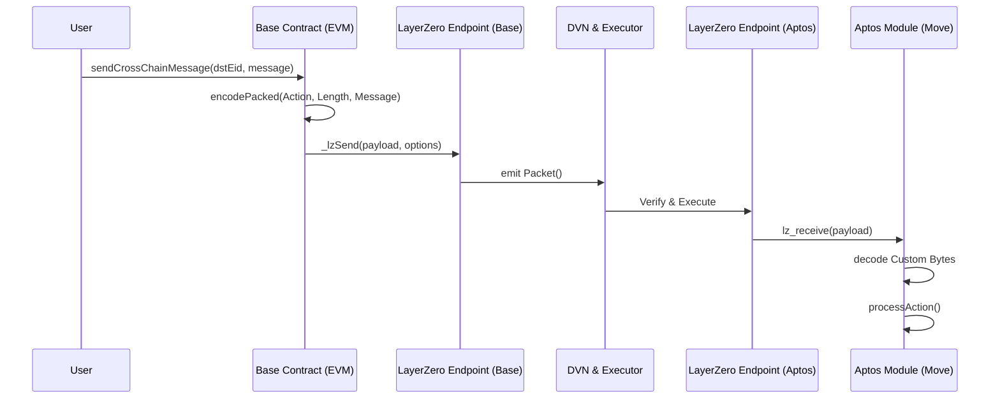

# base-aptos-bridge
# 🌉 Omnichain Base-to-Aptos Bridge (LayerZero V2)

Production-grade cross-chain dApp enabling secure message and state transfers from Base (EVM) to Aptos (Move) using LayerZero V2 OApp architecture.

## Architecture



## Payload Specification

| Bytes | Size | Type | Description |
| :--- | :--- | :--- | :--- |
| `0` | 1 byte | `uint8` | Action ID (1 = Update State) |
| `1-2` | 2 bytes | `uint16` | Message length (Big Endian) |
| `3...` | `Length` bytes | `string` | UTF-8 encoded string |

## Setup & Deployment

### 1. EVM (Base)
```bash
cd evm
npm install
npx hardhat run scripts/deploy.js --network base_sepolia
```

### 2. Aptos
```bash
cd aptos
aptos move publish --profile default
```

### 3. Configuration
```bash
cd evm
npx hardhat run scripts/setPeer.js --network base_sepolia
```
